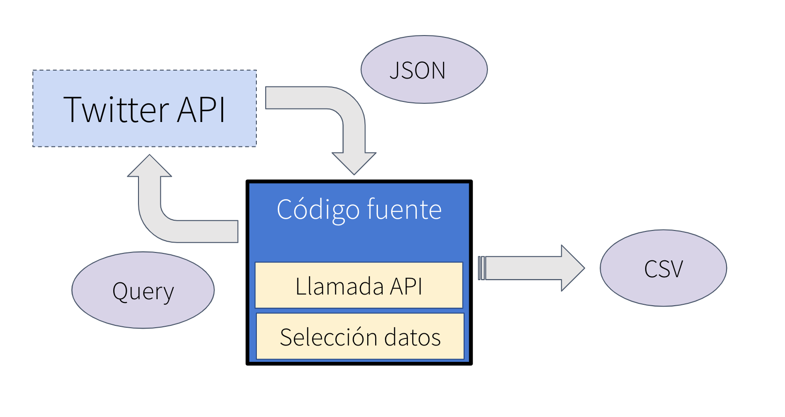

# ¿Qué vamos a hacer?

La primera parte del taller consistirá en desarrollar en código Python este diagrama básico de obtención de datos JSON. Después los exportaremos a un fichero CSV.



La segunda parte del taller consistirá en limpiar esos datos, trabajar con funciones básicas de Natural Language Processing y analizar, entre otros, el sentimiento de los _tweets_ a través de librerías de Python como Textblob o MeaningCloud.


## Requisitos

Este taller se puede llevar a cabo de dos formas: en _cloud_ (opción Google o Azure) o en local (utilizando Jupyter Notebooks). 

* Las plataformas _cloud_ han emulado notebooks iguales o equivalentes a los Jupyter Notebooks. Es por ello que **en las sesiones que imparta en vivo utilizaré preferentemente la plataforma de Google. Por lo tanto no es necesario que instales nada en local.** 

No obstante, en caso de que haya algún problema, para llevar a cabo este taller en un entorno local (tu ordenador), deberás instalar:

* Python 3.5 o superior (si usas OS X o distribuciones de Linux es posible que ya lo tengas instalado)
* Jupyter Notebooks (o Anaconda, que ya los incluye)

También debes tener disponible un editor de código (SublimeText, Atom...) o IDE compatible con Python (Anaconda, Pycharm...). 
 
Revisa tu(s) versión(es) instaladas de Python con el siguiente comando. Si tienes dos versiones diferentes instaladas, seguramente Python 3.6 esté asociado al segundo.

```bash
python --version
python3 --version
```
Para saber dónde está instalada tu versión de Python escribe en la Terminal:
```bash
which python
```

## Librerías de Python

Las librerías recomendadas para este taller son las siguientes:

* tweepy
* pandas
* python-csv
* nltk
* wordcloud
* textblob
* meaningCloud-python

Puedes instalarlas con: 
```bash
pip install <nombre libreria>
```

Revisa que están instaladas correctamente con el siguiente comando:
```bash
pip list
```

También puedes revisar que están instaladas correctamente ejecutando Python en la terminal e importando la librería en cuestión. Si no sale ningún error significa que está instalada correctamente
```bash
python

Python 3.7.6 (default, Apr 28 2020, 10:32:13) 

Type "help", "copyright", "credits" or "license" for more information.

>>> import csv

```

# Índice de contenidos del taller

Para llevar a cabo este taller es necesario validarse como desarrollador dentro de Twitter. Este proceso suele ser inmediato pero a veces puede tardar **un par de días**. Por ello, te pido que lo hagas con antelación. Una vez te concedan el acceso, crea una aplicación para poder comunicarnos con el API. 

   + _El objetivo del taller no es publicar esa aplicación, sólo la utilizarás para obtener datos de la plataforma y explotarlos de forma privada._

* **Trabajo previo**

	1. [Cómo conseguir una cuenta de desarrollador en Twitter](./twitter-account.html).

	1. [Cómo crear tu primera app de Twitter](./twitter-app.html).

	1. [Intro Python](./intro-python.html)

	1. [Intro Pandas](./pandas-csv.html)

* **Durante la sesión en vivo**

	1. [Presentación sobre Natural Language Processing](https://docs.google.com/presentation/d/1SiqhSGy1oeoDrtVvsHXXJ2yuLadsiSGp6FsYqCBf2yA/edit?usp=sharing)

	1. [Introducción a la minería de datos](./intro-textos.md)

	1. [Búsqueda simple](https://drive.google.com/file/d/1G1G2MpUZDAIl91EEPX76sqOZWMdUxFLS/view?usp=sharing)

	1. [Búsqueda en tiempo real (Streaming)](https://drive.google.com/file/d/1BwVY-fIG1nsu6KwewZNZRio5ZFu2CpSD/view?usp=sharing)

	1. [Limpieza de textos y nube de palabras](https://colab.research.google.com/drive/1QfdVEejIknXRw-OTEmKHziRJkpvZU8Dy)

	1. [Análisis del sentimiento](https://drive.google.com/file/d/1q3gVlWkd6bD_5lknXh5FkiiO0prBx7Og/view?usp=sharing)
